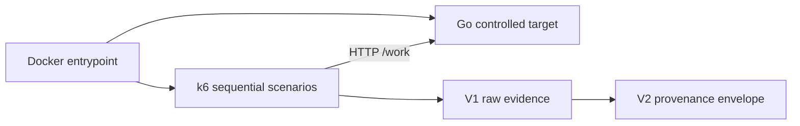

# #29 load-test-suite

[](https://github.com/Brilhante29/load-test-suite/actions/workflows/validate.yml)

**15.1410 ms median p95 at 20 VUs**, across three complete curves, with
**41,234 requests** and **0% errors**. Exact values:
`p95_ms_at_max_vus=15.14099235`, `total_requests=41234`.

**Proves:** a reusable Dockerized k6 suite measures HTTP tail latency and
throughput across 1, 5, 10, and 20 VUs against a controlled four-slot Go
target. Lower p95 is better; any HTTP error or p95 above 100 ms fails the run.

| VUs | Median p95 | Requests/s | Requests | Error rate |
|---:|---:|---:|---:|---:|
| 1 | 3.3461 ms | 293.33 | 2,640 | 0% |
| 5 | 5.0537 ms | 1,384.00 | 12,456 | 0% |
| 10 | 8.9508 ms | 1,452.67 | 13,074 | 0% |
| 20 | **15.1410 ms** | 1,451.56 | 13,064 | 0% |

The three 20-VU p95 samples were `14.9140293`, `15.14099235`, and
`15.2416762 ms`. Throughput plateaus near 1,453 req/s while tail latency
keeps rising, exposing the four-slot target's queueing behavior.

- Raw V1: [`benchmarks/results/29-p95-curve-v1.json`](benchmarks/results/29-p95-curve-v1.json)
- Publication V2: [`benchmarks/publication/29-p95-curve-v2.json`](benchmarks/publication/29-p95-curve-v2.json)
- Source commit: `3146602070006665950e42aeddc5aca19a8670db`
- Image: `sha256:64f9c11c4de6a65cde252ccbb959091dd9b55e089e8c2499c070e14912af34f6`

## Run

Requirements: Docker Engine or Docker Desktop. Python 3.12 with
`requirements-validation.txt` is required only to generate publication
evidence.

```bash
docker build -t load-test-suite:local .
docker run --rm \
  -v "$PWD/benchmarks/results:/results" \
  -e RESULT_FILE_NAME=p95-curve-local.json \
  load-test-suite:local benchmark
```

PowerShell produces the same result without installing k6 or Go:

```powershell
pwsh -NoProfile -File scripts/benchmark.ps1 -ImageTag load-test-suite:local
```

Generate canonical V1 and V2 evidence from a clean commit:

```powershell
python -m pip install -r requirements-validation.txt
pwsh -NoProfile -File scripts/publish-benchmark.ps1 -Build
```

## Workload

Each repetition runs one warm-up window and four sequential three-second
measurement windows. The target exposes four worker slots with 2 ms of service
time per request, so concurrency above four creates observable queueing rather
than synthetic random delay.

| Level | VUs | Window | Failure gate |
|---:|---:|---:|---:|
| 1 | 1 | 3 s | error rate = 0, p95 < 100 ms |
| 2 | 5 | 3 s | error rate = 0, p95 < 100 ms |
| 3 | 10 | 3 s | error rate = 0, p95 < 100 ms |
| 4 | 20 | 3 s | error rate = 0, p95 < 100 ms |

The headline sample for each repetition is p95 at 20 VUs. The published value
is the median of those three samples; the JSON preserves all 12 curve points
and request rates. Compare runs only when their V2 `comparability_key`
matches; host CPU scheduling still affects local Docker latency.

## Architecture



The repository is a small modular monolith. `internal/target` owns the HTTP
fixture, `k6/scenarios` owns load generation, and `k6/report` owns evidence
aggregation. The modules depend on HTTP and the k6 summary contract, not on
each other's implementation.

## Validate

```powershell
pwsh -NoProfile -File tools/validate-project.ps1 -Strict
```

CI runs Go tests and vet, formatting and JavaScript checks, V2 provenance
validation, a Docker build, and an isolated smoke benchmark. The smoke result
is written outside the checkout and never overwrites committed evidence.

- Decisions: [`sdd/`](sdd/spec.md)
- OpenSpec artifacts: [`openspec/changes/implement-load-test-suite/`](openspec/changes/implement-load-test-suite/)
- Reuse attribution: [`REFERENCES.md`](REFERENCES.md)
