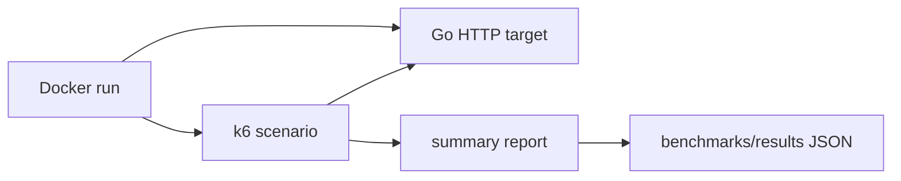

# #29 load-test-suite

**Status:** benchmarked

**Proves:** uma suite Dockerizada mede uma curva p95 reproduzivel de um alvo HTTP local sob 1, 5, 10 e 20 VUs.

**Benchmark:** `p95_curve`, baseline versionado em [`benchmarks/results/p95-curve-baseline.json`](benchmarks/results/p95-curve-baseline.json).

| VUs | p95 (ms) | Requests | Error rate |
|---:|---:|---:|---:|
| 1 | 0.9934 | 2,877 | 0 |
| 5 | 1.5960 | 13,970 | 0 |
| 10 | 2.0660 | 26,351 | 0 |
| 20 | 5.3777 | 30,874 | 0 |

**Baseline:** max p95 `5.3777 ms`, `74,072` requests, `0%` errors. Image `load-test-suite:local` (`sha256:f3a0258253f88b3fd8f5c78a4398df6463cee400bad3ce60dbd5d5bc2f65c892`), k6 `0.49.0`, commit `3db47ef`.

O valor `p95_curve` no contrato JSON e o maior p95 observado entre os quatro niveis. O resultado tambem guarda a imagem, o ambiente, o commit e os parametros do ensaio.

## 1. Pre-requisitos

- Docker Engine ou Docker Desktop.
- PowerShell 7+ para o script Windows ou POSIX shell para `scripts/benchmark.sh`.
- Nenhum segredo, banco ou servico pago.

## 2. Construir a imagem

```bash
docker build -t load-test-suite:local .
```

O Dockerfile compila o alvo HTTP Go como binario estatico e o coloca na
imagem pinada do k6. Go foi usado porque aumenta o valor demonstrado neste
projeto: o alvo local tem baixo overhead, inicializacao simples e nao adiciona
um interpretador ao runtime. A suite de carga continua sendo k6/JavaScript.

## 3. Rodar o benchmark

PowerShell:

```powershell
pwsh -NoProfile -File scripts/benchmark.ps1 -ImageTag load-test-suite:local -ResultName p95-curve-local.json
```

POSIX:

```bash
./scripts/benchmark.sh
```

Para gerar o baseline versionado:

```powershell
pwsh -NoProfile -File scripts/benchmark.ps1 -Build -ResultName p95-curve-baseline.json
```

O caminho equivalente usando apenas Docker e gravando no checkout e:

```bash
docker run --rm \
  -v "$PWD/benchmarks/results:/results" \
  -e RESULT_FILE_NAME=p95-curve-baseline.json \
  -e BENCHMARK_IMAGE=load-test-suite:local \
  load-test-suite:local benchmark
```

## 4. Inspecionar o alvo

```bash
docker run --rm -p 8080:8080 load-test-suite:local target
```

Em outro terminal, `GET http://localhost:8080/health` retorna o fixture JSON
estavel. O cenario pode apontar para outro alvo HTTP com `TARGET_URL`, desde
que o contrato retorne status 2xx.

## 5. Reproduzir a curva

O perfil executa um warmup de 1 segundo e quatro janelas sequenciais de 3
segundos, com 1, 5, 10 e 20 VUs constantes. O resultado em
`benchmarks/results/` contem uma linha por nivel e e compativel com o contrato
de benchmark do kit.



## 6. Testar e validar

```powershell
go test ./...
go vet ./...
node --check k6/p95-curve.js
pwsh -NoProfile -File tools/validate-project.ps1 -Strict
```

O CI repete testes Go, sintaxe k6, build da imagem, benchmark e validacao
estrita.

## 7. Arquitetura e decisoes

O repositorio usa um modular monolith pequeno: `internal/target` isola o
contrato HTTP, `k6/scenarios` define a carga e `k6/report` transforma o
summary em evidencia. O alvo nao importa k6, e o benchmark nao precisa de
framework de aplicacao.

- Decisoes SDD: [`sdd/`](sdd/spec.md).
- Artefatos OpenSpec: [`openspec/changes/implement-load-test-suite/`](openspec/changes/implement-load-test-suite/).
- Atribuicao de reuso: [`REFERENCES.md`](REFERENCES.md).
